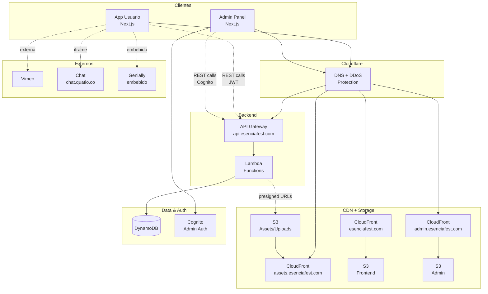

# Arquitectura de Alto Nivel - Esencia Fest 2025

## DIAGRAMA GENERAL DEL SISTEMA

## COMPONENTES PRINCIPALES

### Aplicaciones Cliente
- **App Usuario** (Next.js Static Export): SPA ciudadela virtual, foro, salas
- **Admin Panel** (Next.js Static Export): SPA configuración, estadísticas, logs
- **NO SSR**: Deploy estático a S3 + CloudFront

### Backend Serverless
- **API Gateway**: Endpoints REST
- **Lambda Functions**: Lógica de negocio
- **DynamoDB**: Base de datos aplicación
- **CloudFront**: CDN global por subdominio
- **S3**: Buckets separados por función

### Autenticación
- **Cognito**: Solo admin panel (autenticación robusta)
- **JWT**: Usuarios regulares (email corporativo)

### Servicios Externos
- **Vimeo**: Videos (conexión externa)
- **Chat**: chat.quatio.co (iframe embebido)
- **Genially**: Microcursos (embebido HTML)

## DECISIONES ARQUITECTÓNICAS CLAVE

### 1. Autenticación Híbrida
**Decisión**: JWT para usuarios + Cognito para admin
**Justificación**: 
- Timeline crítico: JWT simple, sin complejidad Cognito para usuarios
- Seguridad admin: Cognito para funciones sensibles
- Token sin expiración: evento temporal (1 semana)

### 2. Polling vs WebSockets
**Decisión**: Polling cada 30 segundos
**Justificación**:
- 500 usuarios × 30s = ~17 req/s (manejable)
- Implementación simple vs complejidad WebSocket
- Estados ciudadela menos críticos que chat (IVS externo)

### 3. Chat Externo Propio
**Decisión**: chat.quatio.co vs desarrollo en proyecto
**Justificación**:
- Desarrollo propio pero independiente
- Embebido iframe con sala dedicada
- Moderación ya implementada

### 4. Cloudflare como Proxy
**Decisión**: Cloudflare gratuito para DNS + protección
**Justificación**:
- Dominio ya registrado en Cloudflare
- DDoS protection gratuita
- SSL/TLS automático
- DNS management centralizado

### 5. Arquitectura Multi-Subdominio
**Decisión**: Subdominios separados vs dominio único
**Justificación**:
- Separación clara responsabilidades
- Admin aislado (seguridad)
- Políticas caché independientes
- Escalabilidad por servicio

### 6. Serverless vs Containers
**Decisión**: Serverless completo (Lambda + DynamoDB)
**Justificación**:
- Auto-escalado para 7K usuarios
- Cero gestión infraestructura
- Pay-per-use para evento temporal

### 7. Genially Embebido
**Decisión**: HTML embebido vs enlace externo
**Justificación**:
- Experiencia usuario integrada
- Tracking completado desde embed
- Fallback a enlace si falla

### 8. Upload de Archivos y CDN Assets (✅ IMPLEMENTADO)
**Decisión**: Presigned URLs + S3 + CloudFront para assets
**Justificación**:
- Bypass Lambda para archivos grandes (>1MB)
- Mejor performance usuario
- S3 + CloudFront automático para assets

**Implementación Actual**:
- **S3 Bucket**: `esenciafest-2025-assets-{env}` con políticas OAC
- **CloudFront**: SSL + custom domains (`assets.dev.esenciafest.com`)
- **Presigned URLs**: Endpoint `/uploads/presigned-url` con validación de tipos
- **Genially Content**: HTML completo servido desde CDN (`/genially/sura-content/`)
- **Tipos soportados**: Imágenes, videos, HTML, documentos (PDF, JSON, etc.)

### 9. Estrategia de Actualización
**Decisión**: Polling vs WebSockets/Server-Sent Events
**Justificación**:
- Estados ciudadela: polling 30s (menos crítico)
- Foro: lazy loading + paginación
- Chat: WebSockets para tiempo real

### 10. Arquitectura Multi-Región
**Decisión**: CDN global vs regional
**Justificación**:
- CloudFront distribución 6 países
- UTC centralizado para zonas horarias
- Whitelist dominios corporativos por país

### 11. Separación por Subdominios
**Decisión**: Subdominios vs rutas en dominio único
**Justificación**:
- **Aislamiento**: Admin separado de usuarios
- **Escalabilidad**: Caché y CDN independientes
- **Seguridad**: Políticas diferentes por función
- **Desarrollo**: Teams independientes por subdominio

### Subdominios
- `esenciafest.com`: App principal usuarios
- `admin.esenciafest.com`: Panel administración (aislado)
- `assets.esenciafest.com`: Assets estáticos + uploads
- `api.esenciafest.com`: Backend API REST

---
*Arquitectura diseñada para timeline crítico 25 jul - 18 ago*