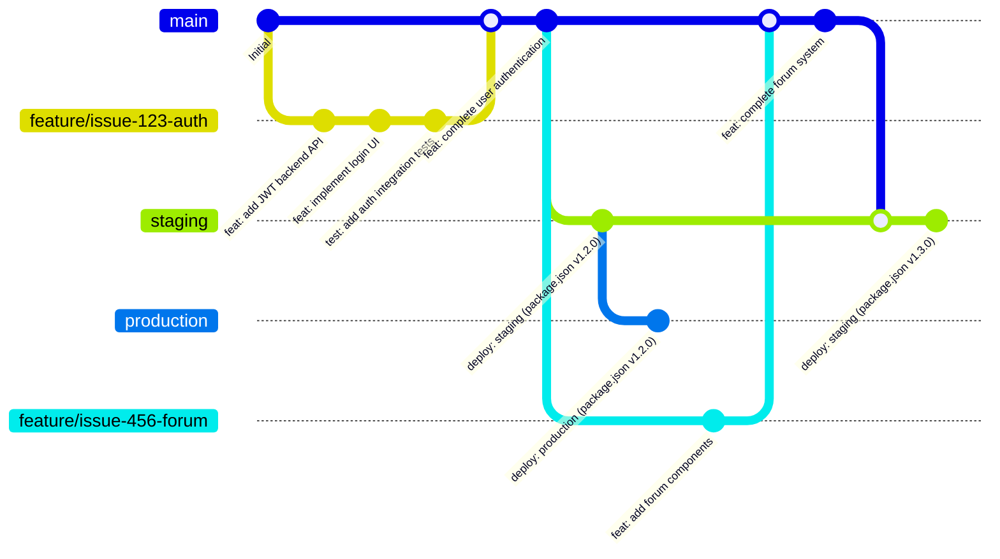
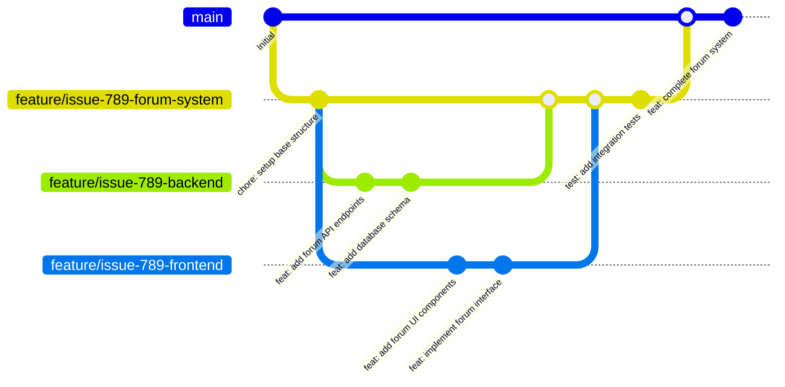

# Guía de Contribuciones - SURA Esencia Fest 2025

## Git Flow con Environment Branches

### Flujo Principal: Development → Staging → Production



### Ejemplo con Subramas (Caso Complejo)



## Estrategia de Branching

### Environment Branches
- **`main`**: Desarrollo e integración de features
- **`staging`**: Deploy a staging environment (solo desde main)
- **`production`**: Deploy a production environment (solo desde staging)

### Feature Branches
- Formato: `feature/issue-{numero}-{descripcion}`
- Se derivan de `main` y regresan a `main` vía PR

## Cuándo Usar Cada Estrategia

### Caso 1: Issue Simple (1 rama)
- **Cambios pequeños**: UI fixes, copy changes, single component
- **Ejemplo**: Fix button style, update text, add validation
- **Una sola rama**: `feature/issue-123-fix-button`

### Caso 2: Issue Complejo (1 rama secuencial)
- **Multi-componente**: Backend + Frontend + Admin, pero **UN developer**
- **Desarrollo secuencial**: Primero backend, luego frontend, luego tests
- **Una sola rama**: `feature/issue-456-user-auth`

### Caso 3: Issue con Subramas (trabajo paralelo)
- **Multi-componente + múltiples developers**
- **Desarrollo paralelo**: Backend dev + Frontend dev trabajando simultáneamente
- **Rama madre + subramas**: 
  ```
  feature/issue-789-forum-system     # Rama madre
  ├── feature/issue-789-backend      # Subtask para backend dev
  └── feature/issue-789-frontend     # Subtask para frontend dev
  ```

**Usar subramas SOLO cuando:**
- **Funcionalidades independientes**: Backend y frontend pueden desarrollarse por separado
- **Conviene trabajo paralelo**: Por eficiencia, no necesariamente múltiples developers
- **Componentes desacoplados**: Una parte no bloquea la otra

**REGLA MANDATORIA: Si usas subramas, DEBES crear sub-issues**

**Workflow Obligatorio:**
```
1. Identificar issue complejo
2. Crear sub-issues ANTES de crear subramas
3. Una subrama por sub-issue (mapping 1:1)
4. Cerrar sub-issue cuando se mergea subrama
5. Cerrar issue padre cuando se mergea rama madre

Issue #789: "Sistema de foro completo" → feature/issue-789-forum-system (rama madre)
├── Sub-issue #789-1: "Configurar API Backend Foro" → feature/issue-789-api-backend
└── Sub-issue #789-2: "Implementar UI Components Foro" → feature/issue-789-ui-components
```

**Ejemplos:**
- ✅ **SÍ**: Sistema auth (API independiente del diseño UI)
- ✅ **SÍ**: Galería 360° (Three.js independiente de navegación)
- ❌ **NO**: Bug fix (requiere cambio coordinado)
- ❌ **NO**: Feature que depende de API específica

## Environment Promotion Strategy

### 1. Development (main branch)
- Desarrollo diario y integración de features
- Testing local y validación de cambios

### 2. Staging Environment
- **Trigger**: Merge `main` → `staging` branch
- **Deploy**: Solo desde rama `staging` (GitHub Actions o manual)
- **Propósito**: UAT y validación pre-producción

### 3. Production Environment  
- **Trigger**: Merge `staging` → `production` branch
- **Deploy**: Solo desde rama `production` (GitHub Actions o manual)
- **Control**: Coordinado con cliente, deploy controlado

### Branch Protection
- Deploy **solo** desde rama correspondiente al environment
- Frontend: GitHub Actions con branch restrictions
- Backend: Scripts que validan rama actual antes de deploy


## Code Review Process

### Requisitos Simples
- **1 approval requerido** de cualquier team member para merge
- Usar GitHub branch protection rules

## Convenciones

### Branches
- `feature/issue-123-user-authentication` - nueva funcionalidad
- `fix/issue-124-login-validation` - corrección de bug
- `hotfix/issue-125-security-patch` - fix crítico

**Naming Guidelines:**
- Usar nombres **descriptivos de la tarea específica**, no genéricos
- ✅ Correcto: `feature/issue-1-cloudformation-frontend`
- ❌ Evitar: `feature/issue-1-frontend`
- Branch name debe reflejar exactamente qué se está implementando

### Commits
- `feat:` nueva funcionalidad
- `fix:` corrección de bug  
- `refactor:` cambio de código sin nueva funcionalidad
- `test:` agregar o modificar tests
- `docs:` cambios en documentación
- `chore:` mantenimiento (deps, config, setup)

### PRs
- Título: `feat: [Issue #123] User authentication`
- Incluir: `Closes #123`, testing notes

### Issues  
- Usar **GitHub Labels**: `backend`, `frontend`, `infrastructure`, `multi-component`

**Sub-Issues Naming:**
- Nombres específicos que describan la tarea exacta
- Deben coincidir conceptualmente con el nombre de la branch
- ✅ Correcto: "Configurar CloudFormation Frontend"
- ❌ Evitar: "Frontend Infrastructure"
- Formato: `#[numero-padre]-[secuencia]: "[Verbo] [Componente Específico] [Contexto]"`

### Versioning
- **Source of truth**: `package.json` version field
- **Workflow**: Developer actualiza version → commit → deploy lee package.json
- **Same artifact**: Staging y production usan misma version (no rebuild)
- **Ejemplo**: `"version": "1.2.0"` en package.json → deploy usa v1.2.0

---

## Principios Clave
- **Environment branches**: main → staging → production
- **Deploy controlado**: Solo desde rama correspondiente al environment  
- **Una rama por feature**: Backend + frontend juntos (salvo excepciones)
- **Subramas obligatorias**: Si usas subramas, DEBES crear sub-issues
- **Code review**: 1 approval requerido para merge